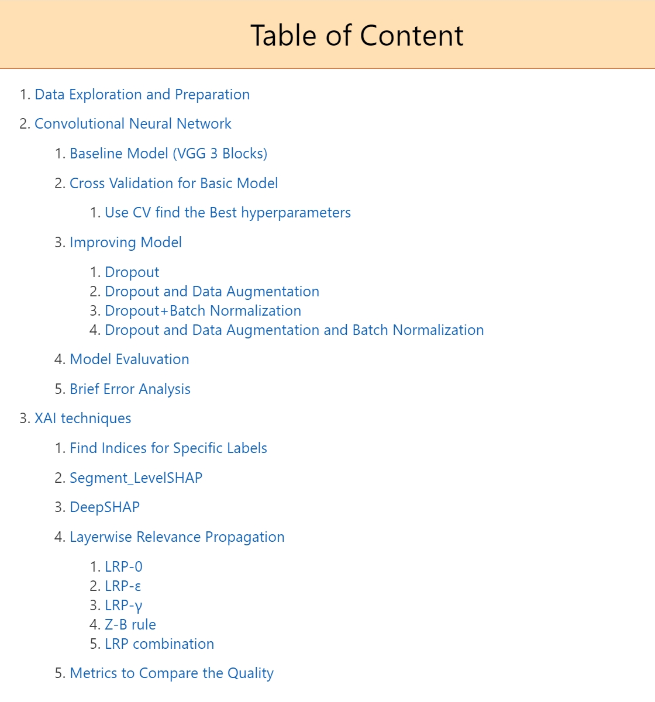

Please open at unrestricted Mode, in that case the code can show all the output. ALL code output(the picture, the data) is attached in the jupyter notebook.

When opened, it should be in color. If there is no colored title, it is likely still in restricted mode, which means you probably won't be able to view the code output images either. If you are using a compiler like VSCode, it is recommended to first exit restricted mode, then close the code in VSCode, and reopen it.

If you cannot check the output or have any questions about the code, please don't hesitate to contact me. <evettecabag@gmail.com>

